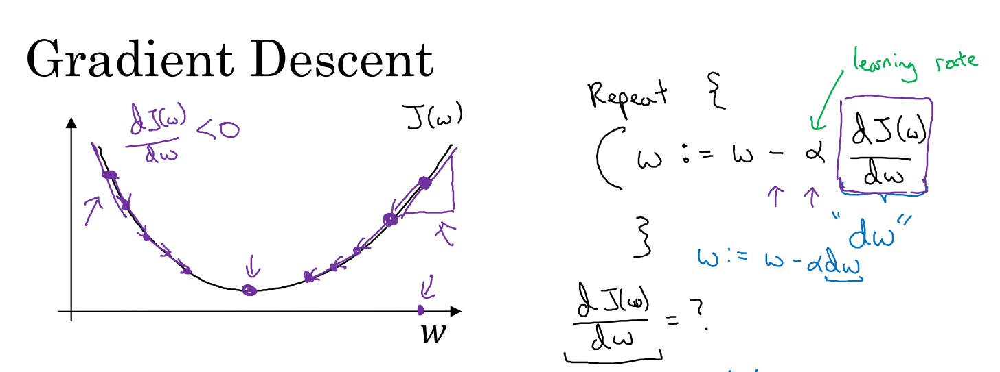

# 梯度下降

- [梯度下降](#梯度下降)
  - [梯度下降形象化说明](#梯度下降形象化说明)
  - [梯度下降细节化说明](#梯度下降细节化说明)

模型的训练目标是在训练集中寻找最适合的参数 $w$ 和 $b$ 以最小化代价函数 $J(w, b)$ 的值。

我们可以通过 **梯度下降（Gradient Descent）** 的方法来寻找参数。

## 梯度下降形象化说明

简单起见我们先假设 $w$ 与 $b$ 都是一维实数，那么可以得到如下的 $J(w, b)$ 关于 $w$ 与 $b$ 的图：

代价函数 $J(w, b)$ 是一个 **凸函数**，与非凸函数的区别在于其不含有多个局部最低点；选择这样的代价函数就保证了无论我们初始化模型参数如何，都能够寻找到合适的最优解。

梯度下降的步骤：

1. 初始化 $w$ 和 $b$
2. 朝最陡的下坡方向走一步，不断地迭代
3. 直到走到全局最优解或者接近全局最优解的地方

对于逻辑回归几乎所有的初始化方法都有效，因为函数是凸函数，无论在哪里初始化，应该达到同一点或大致相同的点。

## 梯度下降细节化说明

假定代价函数只有一个参数 $w$ ，即用一维曲线代替多维曲线，这样可以更好画出图像。

梯度下降就是在算法收敛钱不断重复执行以下更新操作：

**Repeat {**

$w := w - \alpha \frac{dJ(w)}{dw}$

**}**

- $:=$ 表示更新操作
- $\alpha$ 表示 **学习率（learning rate）**，用来控制每一次迭代中的步长大小
- $\frac{dJ(w)}{dw}$ 为函数 $J(w)$ 对 $w$ **求导（derivative）**

> 导数的定义：函数在一个点上的斜率，而函数的斜率是高除宽。

导数为正的话向左移动，反之向右移动。

逻辑回归的代价函数 $J(w, b)$ 是含有两个参数的，所以更新公式如下所示：
$$
\begin{aligned}
Repeat \{ & \\
& w := w - \alpha \frac{\partial J(w, b)}{\partial w} \\
& b := b - \alpha \frac{\partial J(w, b)}{\partial b} \\
& \} \\
\end{aligned}
$$

> $\partial$ 表示求偏导符号，可以读作 **round**。

$\frac{\partial J(w, b)}{\partial w}$ 是函数 $J(w, b)$ 对 $w$ 求偏导，$b$ 同理。

字母 $d$ 用在求 **导数（derivative）**，即函数只有一个参数；

偏导数符号 $\partial$ 用在求 **偏导（partial derivative）**，即函数含有两个以上的参数。