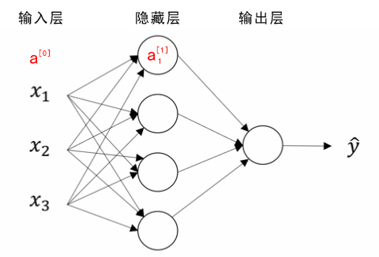

# 神经网络的表现形式

竖向堆叠起来的输入特征被称作神经网络的 **输入层（the input layer）**。

神经网络的 **隐藏层（a hidden layer）**。“隐藏”的含义是在训练集中，这些中间节点的真正数值是无法看到的。

**输出层（the output layer）** 负责输出预测值。

如图是一个 **双层神经网络**，也称作 **单隐层神经网络（a single hidden layer neural network）**。

当我们计算网络的层数时，通常不考虑输入层，因此图中隐藏层是第一层，输出层是第二层。

约定俗成的符号表示是：

- 输入层的激活值为 $a^{[0]}$；
- 同样，隐藏层也会产生一些激活值，记作 $a^{[1]}$ 隐藏层的第一个单元（或者说节点）就记作 $a^{[1]}_1$ 输出层同理。
- 另外，隐藏层和输出层都是带有参数 $W$ 和 $b$ 的。它们都使用上标 $[1]$ 来表示是和第一个隐藏层有关，或者上标 $[2]$ 来表示是和输出层有关。
