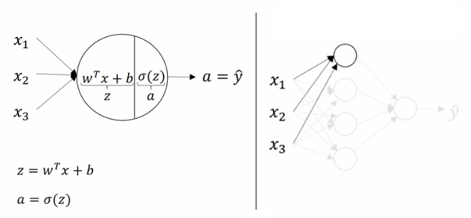

# 计算神经网络的输出

左图为一个 Logistic 回归的网络结构，右图为只有一个隐藏层的简单两层神经网络结构。

神经网络只不过将 Logistic 回归的计算步骤重复很多次。对于隐藏层的第一个节点，有

$$
z^{[1]}_1 = (W^{[1]}_1)^{T}X + b^{[1]}_1
\\
a^{[1]}_1 = \sigma(z^{[1]}_1)
$$

以此类推，隐藏层的第二个以及后面的神经元的计算过程一样，只是注意符号表示不同，最终分别得到 $a^{[1]}_2,a^{[1]}_3,a^{[1]}_4$，以此可得整个隐藏层公式如下：

$$
z^{[1]} = (W^{[1]})^{T}a^{[0]} + b^{[1]}
\\
a^{[1]} = \sigma(z^{[1]})
$$

使用向量化的详细过程如下所示：

$$
a^{[0]} = \begin{bmatrix}
x_1 \\
x_2 \\
x_3 \\
\end{bmatrix}，
W^{[1]}_n 为 3 \times 1的矩阵
\\
z^{[1]} = \begin{bmatrix}
z^{[1]}_1 \\
z^{[1]}_2 \\
z^{[1]}_3 \\
z^{[1]}_4 \\
\end{bmatrix}
= \begin{bmatrix}
W^{[1]T}_1 \\
W^{[1]T}_2 \\
W^{[1]T}_3 \\
W^{[1]T}_4 \\
\end{bmatrix} * \begin{bmatrix}
x_1 \\
x_2 \\
x_3 \\
\end{bmatrix} + \begin{bmatrix}
b^{[1]}_1 \\
b^{[1]}_2 \\
b^{[1]}_3 \\
b^{[1]}_4 \\
\end{bmatrix}
\\
a^{[1]} = \begin{bmatrix}
a^{[1]}_1 \\
a^{[1]}_2 \\
a^{[1]}_3 \\
a^{[1]}_4 \\
\end{bmatrix}
= \sigma(z^{[1]})
$$

同理，对于输出层有：

$$
z^{[2]} = (W^{[2]})^{T}a^{[1]} + b^{[2]}
\\
a^{[2]} = \sigma(z^{[2]})
$$

值得注意的是层与层之间参数矩阵的规格大小：

- 输入层和隐藏层之间：${(W^{[1]})}^T$的 shape 为(4,3)，前面的 4 是隐藏层神经元的个数，后面的 3 是输入层神经元的个数；$b^{[1]}$的 shape 为(4,1)，和隐藏层的神经元个数相同。
- 隐藏层和输出层之间：${(W^{[2]})}^T$的 shape 为(1,4)，前面的 1 是输出层神经元的个数，后面的 4 是隐藏层神经元的个数；$b^{[2]}$的 shape 为(1,1)，和输出层的神经元个数相同。
