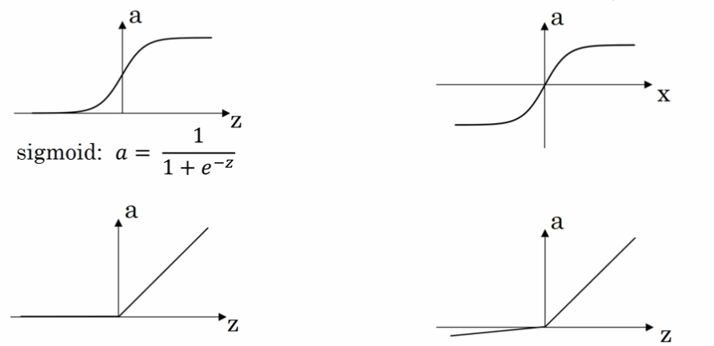

# 激活函数

- [激活函数](#激活函数)
  - [sigmoid 函数](#sigmoid-函数)
  - [tanh 函数（the hyperbolic tangent function，双曲正切函数）](#tanh-函数the-hyperbolic-tangent-function双曲正切函数)
  - [ReLU 函数（the rectified linear unit，修正线性单元）](#relu-函数the-rectified-linear-unit修正线性单元)
  - [Leaky ReLU（带泄漏的 ReLU）：](#leaky-relu带泄漏的-relu)

有一个问题是神经网络的隐藏层和输出单元用什么激活函数。之前我们都是选用 sigmoid 函数，但有时其他函数的效果会好得多。

## sigmoid 函数

$$
a = \frac{1}{1+e^{-z}}
$$

sigmoid 函数也叫 Logistic 函数，用于隐层神经元输出，取值范围为 (0,1)，它可以将一个实数映射到 (0,1) 的区间，可以用来做二分类。在特征相差比较复杂或是相差不是特别大时效果比较好。

Sigmoid 作为激活函数有以下优缺点：
- 优点：平滑、易于求导。
- 缺点：激活函数计算量大，反向传播求误差梯度时，求导涉及除法；反向传播时，很容易就会出现梯度消失的情况，从而无法完成深层网络的训练。

## tanh 函数（the hyperbolic tangent function，双曲正切函数）

$$
a=\frac{e^{z}−e^{−z}}{e^{z}+e^{−z}}
$$

效果几乎总比 sigmoid 函数好（除开 **二元分类的输出层**，因为我们希望输出的结果介于 0 到 1 之间），因为函数输出介于 -1 和 1 之间，激活函数的平均值就更接近 0，有类似数据中心化的效果。

然而，tanh 函数存在和 sigmoid 函数一样的缺点：当 z 趋紧无穷大（或无穷小），导数的梯度（即函数的斜率）就趋紧于 0，这使得梯度算法的速度大大减缓。

## ReLU 函数（the rectified linear unit，修正线性单元）

$$
a=max(0,z)
$$

当 z > 0 时，梯度始终为 1，从而提高神经网络基于梯度算法的运算速度，收敛速度远大于 sigmoid 和 tanh。然而当 z < 0 时，梯度一直为 0，但是实际的运用中，该缺陷的影响不是很大。

## Leaky ReLU（带泄漏的 ReLU）：

$$
a=max(0.01z,z)
$$

Leaky ReLU 保证在 z < 0 的时候，梯度仍然不为 0。理论上来说，Leaky ReLU 有 ReLU 的所有优点，但在实际操作中没有证明总是好于 ReLU，因此不常用。

在选择激活函数的时候，如果在不知道该选什么的时候就选择 ReLU，当然也没有固定答案，要依据实际问题在交叉验证集合中进行验证分析。当然，我们可以在不同层选用不同的激活函数。
