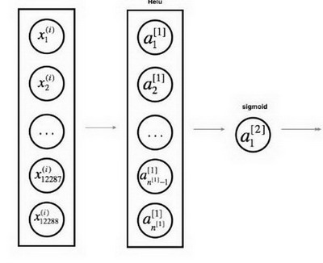

# 深度学习符号

- [深度学习符号](#深度学习符号)
  - [常用的定义](#常用的定义)
    - [数据标记与上下标](#数据标记与上下标)
    - [神经网络模型](#神经网络模型)
      - [正向传播方程示例](#正向传播方程示例)
      - [通用激活公式](#通用激活公式)
      - [损失函数](#损失函数)
  - [深度学习图示](#深度学习图示)
    - [详细网络](#详细网络)
    - [简化网络](#简化网络)

## 常用的定义

$x^{(i)}$ 与 $x_i$ 存在混用的情况，请注意识别

### 数据标记与上下标

- 上标 $^{(i)}$ 代表第 $i$ 个训练样本
- 上标 $^{(l)}$ 代表第 $l$ 层
- $m$ 代表数据集的样本数
- 下标 $_x$ 代表输入数据
- 下标 $_y$ 代表输出数据
- $n_x$ 代表输入大小
- $n_y$ 代表输出大小（或者类别数）
- $n^{[l]}_h$ 代表第 $l$ 层的隐藏单元数
- $L$ 代表神经网络的层数
- 在循环中
  - $n_x = n^{[0]}_h$
  - $n_y = n^{[L + 1]}_h$

### 神经网络模型

- $X \in \mathbb{R}^{n_x \times m}$ 代表输入的矩阵
- $x^{(i)} \in \mathbb{R}^{n_x}$ 代表第 $i$ 个样本的列向量
- $Y \in \mathbb{R}^{n_y \times m}$ 是标记矩阵
- $y^{(i)} \in \mathbb{R}^{n_y}$ 是第 $i$ 样本的输出标签
- $W^{[l]} \in \mathbb{R}^{l \times (l - 1)}$ 代表第 $[l]$ 层的权重矩阵
- $b^{[l]} \in \mathbb{R}^{l}$ 代表第 $[l]$ 层的偏差矩阵
- $\hat{y} \in \mathbb{R}^{n_y}$ 是预测输出向量
  - 也可以用 $a^{[L]}$ 表示

#### 正向传播方程示例

- $a = g^{[l]}(W_{x}x^{(i)}+b_{1}) = g^{[l]}(z_{1})$
  - 其中，$g^{[1]}$ 代表第 $l$ 层的激活函数
- $\hat{y} = \text{softmax}(W_{h}h + b_{2})$

#### 通用激活公式

- $a^{[l]}_{j} = g^{[1]}(z^{[l]}_j) = g^{[l]}(\sum_{k}w^{[l]}_{jk}a^{l-1}_{k}+b^{[l]}_j)$
  - $j$ 当前层的维度
  - $k$ 上一层的维度

#### 损失函数

- $J(x, W, b, y)$ 或者 $J(\hat{y}, y)$
- 常见损失函数示例
  - $J_{CE}(\hat{y}, y) = - \sum^{m}_{i=0}y^{(i)}log\hat{y}^{(i)}$
  - $J_{1}(\hat{y}, y) = - \sum^{m}_{i=0} |y^{(i)} - \hat{y}^{(i)}|$

## 深度学习图示

- 节点：代表输入、激活或者输出
- 边：代表权重或者误差

提供两种等效的示意图：

### 详细网络

常用于神经网络的表示，为了更好的审美，我们省略了一些在边上的参数的细节（如 $w^{[l]}_{ij}$ 和 $b^{[l]}_i$ 等）。

### 简化网络

两层神经网络的更简单的表示。
