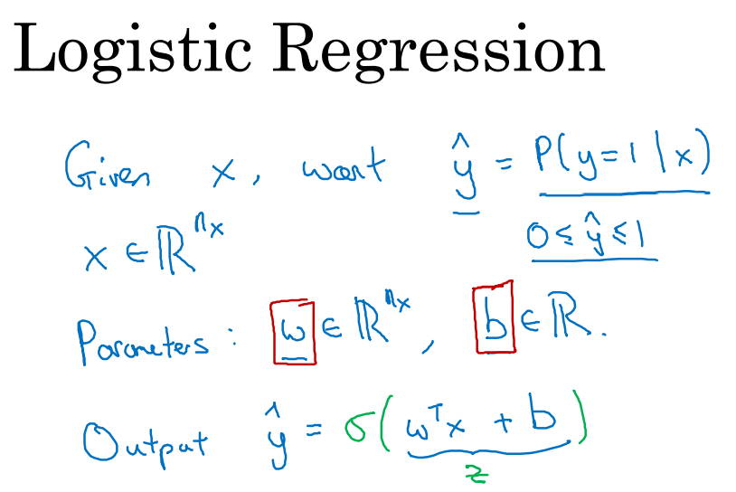

# 逻辑回归

**逻辑回归（Logistic Regression）** 常用于二分类问题。

对于二分类问题，给定一个输入特征向量 $x$，算法输出预测 $\hat{y}$，也就是对实际值 $y$ 的估计。即给定了输入特征 $x$，让 $\hat{y}$ 表示 $y$ 等于 $1$ 的概率。

逻辑回归的式子中的符号：

- $x$ 表示输入的 $n_x$ 维的特征向量
- $y$ 表示训练标签，$y \in \{0, 1\}$
- $\hat{y}$ 表示预测概率，$\hat{y} = P(y=1|x), \hat{y} \in [0, 1]$
- $w$ 表示逻辑回归的参数，也是一个 $n_x$ 维的向量（因为 $w$ 实际上是特征权重，维度与特征向量相同）
- $b$ 表示逻辑回归的参数，是一个实数（表示偏差）

因为 $0 < \hat{y} < 1$， 所以尝试让 $\hat{y} = w^{T}x + b$ 并不可行，$w^{T}x + b$ 可能大于 $1$ 或小于 $0$。

因此在逻辑回归中，输出 $\hat{y}$ 应该是等于上面的线性函数应用与 `sigmoid` 函数的结果中，将线性函数转换为非线性函数。公式如下面所示：

$$\hat{y} = \sigma(w^{T}x + b)$$

下图是 `sigmoid` 函数的图像，把水平轴作为 $z$ 轴，$z = w^{T}x + b$。

因此当你实现逻辑回归时，你的目标就是尽力调整参数 $w$ 以及 $y$ 使得 $\hat{y}$ 能够很好地估计 $y$ 等于 $1$ 的概率。
